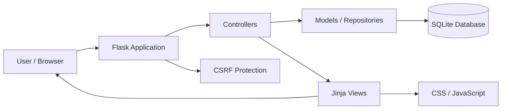
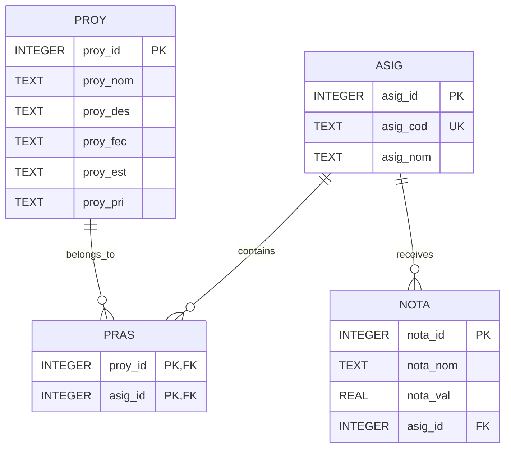

<h1 align="center">University Organizer</h1>

<p align="center">
  A Flask web application for organizing university subjects, academic tasks and deadlines from a single dashboard and monthly calendar.
</p>

<p align="center">
  
  
  
  
  
  
</p>

---

> [!IMPORTANT]
> **University Organizer is currently under active development.**
>
> The application already provides the main functionality required to manage university subjects, tasks, priorities and deadlines, but the project is still evolving.
>
> New features, interface improvements, architectural changes and code optimizations will continue to be incorporated in future versions.

---

<p align="center">
  
</p>

---

## About the Project

**University Organizer** is a university project developed to provide a simple and practical way of managing academic activities from a centralized web application.

The application allows students to register subjects, create tasks, define deadlines, assign priorities and track pending academic work through an interactive dashboard and monthly calendar.

The project is built with **Python and Flask** on the backend, **SQLite** for local data persistence, and **HTML, CSS, JavaScript, Bootstrap and Jinja** for the user interface.

The current version represents the functional foundation of the application. Development is ongoing, and several features are planned to improve its capabilities, architecture and overall user experience.

The interface is currently written in **Spanish**.

---

## Table of Contents

1. [Features](#features)
2. [Project Status](#project-status)
3. [Application Overview](#application-overview)
4. [Technologies](#technologies)
5. [Architecture](#architecture)
6. [Project Structure](#project-structure)
7. [Database](#database)
8. [Security and Validation](#security-and-validation)
9. [Prerequisites](#prerequisites)
10. [Installation](#installation)
11. [Configuration](#configuration)
12. [Running the Application](#running-the-application)
13. [Testing](#testing)
14. [Roadmap](#roadmap)
15. [Current Limitations](#current-limitations)
16. [License](#license)
17. [Contact](#contact)

---

# Features

## Dashboard

The main dashboard provides a general overview of academic activity.

Current functionality includes:

* Display registered subjects.
* Show up to six subjects directly on the dashboard.
* Display a compact monthly calendar.
* Highlight the current day.
* Show the number of tasks scheduled for each date.
* Display upcoming tasks.
* Show tasks scheduled from the current day through the following four days.
* Prioritize urgent tasks when displaying upcoming work.
* Visual indicators for task priorities.
* Direct navigation to:

  * Subjects
  * Tasks
  * Calendar

---

## Subject Management

Subjects can be managed through a complete CRUD workflow.

Users can:

* Create subjects.
* View subject information.
* Edit existing subjects.
* Delete subjects.
* Define a unique subject code.
* Define a subject name.
* Associate tasks with subjects.

The application prevents duplicate subject codes at database level.

---

## Task Management

Tasks are one of the main components of the application.

Users can:

* Create tasks.
* View task details.
* Edit tasks.
* Delete tasks.
* Define a task name.
* Add an optional description.
* Assign a deadline.
* Assign a status.
* Assign a priority.
* Associate a task with multiple subjects.

### Available task statuses

```text
pendiente
en_progreso
terminado
```

### Available task priorities

```text
baja
media
alta
```

Task priorities and statuses are represented visually in the interface using badges and visual indicators.

---

## Task and Subject Relationships

A task can be associated with:

* No subject.
* One subject.
* Multiple subjects.

The relationship between tasks and subjects is implemented through a many-to-many relationship in the database.

Task-subject associations are automatically updated when a task is edited.

---

## Monthly Calendar

The application includes a complete monthly calendar for viewing academic deadlines.

Current functionality includes:

* Complete monthly visualization.
* Monday-to-Sunday layout.
* Navigate to the previous month.
* Navigate to the next month.
* Return to the current month.
* Automatically handle year changes between December and January.
* Highlight the current date.
* Display tasks on their deadline dates.
* Sort tasks by priority.
* Display up to two tasks directly inside each calendar day.
* Display a `+N más` indicator when additional tasks exist.
* Priority legend.

---

## User Interface

The frontend includes:

* Responsive layouts.
* Bootstrap 5.
* Custom CSS.
* Light theme.
* Dark theme.
* Automatic operating-system theme detection.
* Theme preference storage using `localStorage`.
* Animated cards.
* Priority indicators.
* Status badges.
* Confirmation messages.
* Validation messages.
* Flask flash messages.

The interface uses:

* **Space Grotesk**
* **IBM Plex Mono**

through Google Fonts.

---

# Project Status

> 🚧 **Work in Progress**

University Organizer is currently a functional project under active development.

The main academic organization workflow is already implemented, including:

* Subject management.
* Task management.
* Deadlines.
* Priorities.
* Task status.
* Subject-task relationships.
* Dashboard.
* Monthly calendar.
* Local database.
* Form validation.
* CSRF protection.
* Automated testing.

However, the project is **not considered finished**.

The current implementation is intended to serve as a solid base that will continue to evolve as new functionality is added and existing components are improved.

Future versions may introduce changes to:

* Project architecture.
* Database structure.
* User interface.
* Authentication.
* Academic statistics.
* Grade management.
* Notifications.
* Application configuration.
* Testing strategy.
* Code organization.

Breaking changes may occur while the project remains under development.

---

# Application Overview

The application is organized around four main areas:

| Area            | Purpose                                                                       |
| --------------- | ----------------------------------------------------------------------------- |
| **Inicio**      | Main dashboard with subjects, upcoming tasks and mini calendar.               |
| **Tareas**      | Management of tasks, deadlines, priorities, status and subject relationships. |
| **Asignaturas** | Management of university subjects.                                            |
| **Calendario**  | Monthly visualization of academic deadlines and task priorities.              |

---

# Technologies

## Backend


## Database


## Frontend


## Testing


---

# Architecture

The project currently follows an **MVC-inspired architecture** that separates routes, business logic, database repositories and user-interface templates.



---

## Application Layer

`app.py` is responsible for:

* Creating the Flask application.
* Loading the configuration.
* Initializing the database.
* Enabling CSRF protection.
* Registering application blueprints.
* Defining the main dashboard route.

---

## Controller Layer

The `Controller/` directory contains Flask routes and request processing.

```text
Controller/
├── calendar/
│   └── routes.py
├── subjects/
│   └── routes.py
└── tasks/
    └── routes.py
```

---

## Model Layer

The `Model/` directory contains repositories and application logic.

```text
Model/
├── calendar/
│   └── service.py
├── subjects/
│   └── repository.py
└── tasks/
    └── repository.py
```

---

## View Layer

The `View/` directory contains the Jinja templates responsible for rendering the user interface.

Views are separated by application area:

* Dashboard.
* Calendar.
* Subjects.
* Tasks.

---

# Project Structure

```text
University_Organizer/
│
├── app.py
├── config.py
├── requirements.txt
├── requirements-dev.txt
├── .env
├── .gitignore
│
├── BBD/
│   ├── db.py
│   └── organizador.db
│
├── Controller/
│   ├── calendar/
│   │   └── routes.py
│   │
│   ├── subjects/
│   │   └── routes.py
│   │
│   └── tasks/
│       └── routes.py
│
├── Model/
│   ├── calendar/
│   │   └── service.py
│   │
│   ├── subjects/
│   │   └── repository.py
│   │
│   └── tasks/
│       └── repository.py
│
├── View/
│   ├── base.html
│   ├── home.html
│   │
│   ├── calendar/
│   │   └── month.html
│   │
│   ├── subjects/
│   │   ├── detail.html
│   │   ├── form.html
│   │   └── list.html
│   │
│   └── tasks/
│       ├── detail.html
│       ├── form.html
│       └── list.html
│
├── static/
│   ├── base.css
│   ├── calendar.css
│   ├── home.css
│   ├── subjects.css
│   ├── tasks.css
│   ├── theme-init.js
│   └── theme-toggle.js
│
├── tests/
│   ├── conftest.py
│   │
│   ├── unit/
│   │   └── test_calendar_service.py
│   │
│   ├── integration/
│   │   ├── test_subjects_validation.py
│   │   ├── test_tasks_repository.py
│   │   └── test_tasks_validation.py
│   │
│   └── functional/
│       ├── test_calendar_navigation.py
│       ├── test_subjects_crud.py
│       └── test_tasks_crud.py
│
└── docs/
    └── demo.gif
```

---

# Database

University Organizer currently uses **SQLite**.

The default database is:

```text
BBD/organizador.db
```

The database schema is initialized automatically when the Flask application starts.

Foreign-key support is explicitly enabled using:

```sql
PRAGMA foreign_keys = ON;
```

---

## Database Model



---

## `ASIG`

Stores university subjects.

| Field      | Description          |
| ---------- | -------------------- |
| `asig_id`  | Primary key.         |
| `asig_cod` | Unique subject code. |
| `asig_nom` | Subject name.        |

---

## `PROY`

Stores academic tasks.

| Field      | Description                |
| ---------- | -------------------------- |
| `proy_id`  | Primary key.               |
| `proy_nom` | Task name.                 |
| `proy_des` | Optional task description. |
| `proy_fec` | Deadline.                  |
| `proy_est` | Task status.               |
| `proy_pri` | Task priority.             |

---

## `PRAS`

Relationship table between tasks and subjects.

It implements the many-to-many relationship:

```text
TASK <-> SUBJECT
```

Associated relationships are removed automatically when their task or subject is deleted through `ON DELETE CASCADE`.

---

## `NOTA`

The database already contains a table intended for storing grades associated with subjects.

However:

> Grade management is not yet implemented in the web interface.

The table currently exists only at database level and represents one of the areas planned for future development.

---

# Security and Validation

The current application includes several protections appropriate for its development stage.

### CSRF Protection

Global CSRF protection is enabled through:

```text
Flask-WTF
CSRFProtect
```

POST forms include CSRF tokens.

---

### Environment Variables

The Flask secret key is obtained through environment configuration rather than being directly hardcoded into the application source.

The application validates the existence of:

```text
FLASK_SECRET_KEY
```

before starting.

---

### Database Security

SQLite queries use parameterized statements rather than manually concatenating SQL strings.

The database also includes:

* Foreign-key enforcement.
* Unique constraints.
* Status constraints.
* Priority constraints.
* Cascading relationship deletion.

---

### Server-side Validation

The application validates:

* Required subject fields.
* Required task fields.
* Valid task status.
* Valid task priority.
* Subject IDs submitted during task creation.
* Duplicate subject codes.

---

> [!NOTE]
> Authentication and multi-user authorization are not currently implemented.
>
> The current application should therefore be considered a local or single-user academic organizer.

---

# Prerequisites

Before running the project, install:

* [Python 3.10+](https://www.python.org/downloads/)
* `pip`
* [Git](https://git-scm.com/) if the repository will be cloned from GitHub

SQLite is included with Python and does not require a separate database server.

---

# Installation

## 1. Clone the Repository

```bash
git clone git@github.com:EsFiaRn0/University_Organizer.git
```

Enter the project directory:

```bash
cd University_Organizer
```

---

## 2. Create a Virtual Environment

Using a virtual environment is recommended to keep project dependencies isolated.

### Windows PowerShell

```powershell
python -m venv venv
.\venv\Scripts\Activate.ps1
```

### Windows CMD

```bat
python -m venv venv
venv\Scripts\activate
```

### Linux / macOS

```bash
python3 -m venv venv
source venv/bin/activate
```

To exit the environment:

```bash
deactivate
```

---

## 3. Install Dependencies

Install the runtime dependencies:

```bash
python -m pip install -r requirements.txt
```

The application currently uses:

```text
Flask
Flask-WTF
python-dotenv
```

---

## Development Dependencies

If you want to execute the automated tests, install:

```bash
python -m pip install -r requirements-dev.txt
```

Development dependencies currently include:

```text
pytest
pytest-flask
```

---

# Configuration

Create a `.env` file in the root directory of the project.

Example:

```env
FLASK_SECRET_KEY=replace-this-with-a-secure-random-secret
APP_ENV=development
```

A secure random key can be generated using Python:

```bash
python -c "import secrets; print(secrets.token_hex(32))"
```

---

## Development Mode

```env
APP_ENV=development
```

Development mode enables debugging functionality.

---

## Production Mode

```env
APP_ENV=production
```

Production mode disables Flask debugging.

---

> [!WARNING]
> Never upload your real `.env` file to GitHub.
>
> Environment files containing secrets should remain private.

---

# Running the Application

Start Flask with:

```bash
flask --app app run
```

For development:

```bash
flask --app app run --debug
```

Alternatively:

```bash
python -m flask --app app run --debug
```

Flask will normally start the application at:

```text
http://127.0.0.1:5000/
```

Open this address in your browser.

---

## Flask CLI

The following command is **incorrect**:

```bash
flask app.py
```

Flask interprets `app.py` as a command when written this way.

Use:

```bash
flask --app app run
```

instead.

---

# Testing

University Organizer includes automated tests divided into three categories:

```text
Unit
Integration
Functional
```

Install the development dependencies first:

```bash
python -m pip install -r requirements-dev.txt
```

Then execute:

```bash
python -m pytest -q
```

---

## Unit Tests

Current unit tests verify calendar logic such as:

* Previous month calculation.
* Next month calculation.
* Month normalization.
* Out-of-range month values.

---

## Integration Tests

Current integration tests verify:

* Subject validation.
* Duplicate subject codes.
* Task validation.
* Invalid status values.
* Invalid priority values.
* Task-subject associations.
* Invalid subject identifiers.
* Priority ordering.

---

## Functional Tests

Functional tests cover application workflows including:

* Complete subject CRUD.
* Complete task CRUD.
* Task association with multiple subjects.
* Updating task-subject associations.
* Calendar navigation.
* CSRF-aware form submissions.

---

The current source tree contains:

```text
11 automated test functions
```

distributed across the test modules.

Testing will continue to expand as new functionality is introduced.

---

# Roadmap

The following features and improvements are being considered for future versions.

## Academic Features

* [ ] Grade management.
* [ ] Grade statistics.
* [ ] Subject grade averages.
* [ ] Academic performance tracking.
* [ ] More detailed subject information.
* [ ] Additional task categories.
* [ ] Improved task filters.
* [ ] Task search.
* [ ] Deadline reminders.
* [ ] Notifications.
* [ ] Improved dashboard statistics.

---

## User System

* [ ] User registration.
* [ ] User login.
* [ ] Secure authentication.
* [ ] User sessions.
* [ ] User-specific subjects.
* [ ] User-specific tasks.
* [ ] Password management.

---

## Calendar

* [ ] Improved calendar interactions.
* [ ] More detailed task previews.
* [ ] Better daily task visualization.
* [ ] Direct task creation from calendar dates.
* [ ] Additional calendar views.

---

## User Interface

* [ ] Continue improving responsive design.
* [ ] Improve mobile experience.
* [ ] Improve visual consistency.
* [ ] Improve animations.
* [ ] Expand theme customization.
* [ ] Improve accessibility.
* [ ] Improve form interactions.

---

## Architecture

* [ ] Continue refactoring the project structure.
* [ ] Improve separation of responsibilities.
* [ ] Reduce code duplication.
* [ ] Improve reusable components.
* [ ] Improve configuration management.
* [ ] Pin dependency versions.
* [ ] Improve error handling.
* [ ] Expand test coverage.

---

> [!NOTE]
> This roadmap is not final.
>
> Features may be added, removed or redesigned as the project evolves.

---

# Development Philosophy

This repository is intended not only to contain the application, but also to document its evolution.

The project will continue to improve progressively instead of attempting to implement every feature at once.

Development priorities include:

* Clear and maintainable code.
* Separation of responsibilities.
* Avoiding unnecessary duplication.
* Simple application architecture.
* Reusable logic.
* Secure input handling.
* Consistent validation.
* Automated testing.
* Responsive user interfaces.
* Continuous refactoring.
* Incremental functionality.

Existing components may be rewritten or reorganized when a better implementation is identified.

---

# Current Limitations

University Organizer is still under development and currently has several known limitations.

### No authentication

There is currently no:

* Login.
* Registration.
* User account.
* Role system.

---

### Single-user approach

The application is currently designed primarily for local and lightweight use.

---

### Grade system incomplete

The `NOTA` table exists in the database, but there are currently no:

* Controllers.
* Repositories.
* Forms.
* Views.

for grade management.

---

### SQLite

SQLite is currently used as the database engine.

This is appropriate for the current project scope but could be reconsidered if the application grows into a larger multi-user platform.

---

### External frontend resources

Bootstrap and Google Fonts are currently loaded through public CDNs.

An internet connection may therefore be required for some visual resources.

---

### Dependency versions

Dependencies are currently listed without strict version pinning.

This may be improved in future versions to provide more reproducible development environments.

---

# Contributing

The project is currently being developed and improved.

Suggestions, bug reports and ideas for future functionality are welcome.

If you want to experiment with the project:

1. Fork the repository.
2. Create a new branch.
3. Make your changes.
4. Test your implementation.
5. Submit a pull request.

Example:

```bash
git checkout -b feature/new-feature
```

---

# License

This repository currently does **not** include an explicit `LICENSE` file.

A license will be defined in a future version if the project is published for reuse or redistribution.

Until then, the absence of a license should not be interpreted as granting unrestricted permission to copy, modify or redistribute the project.

---

# Contact

If you have questions, suggestions or ideas for improving the project:

📧 **Email:**
[migelito.olivaresm@gmail.com](mailto:migelito.olivaresm@gmail.com)

🐙 **GitHub:**
[EsFiaRn0](https://github.com/EsFiaRn0)

---

<p align="center">
  <strong>University Organizer</strong>
</p>

<p align="center">
  A university project continuously evolving and improving.
</p>

<p align="center">
  Thanks for visiting ʕ•́ᴥ•̀ʔっ
</p>
